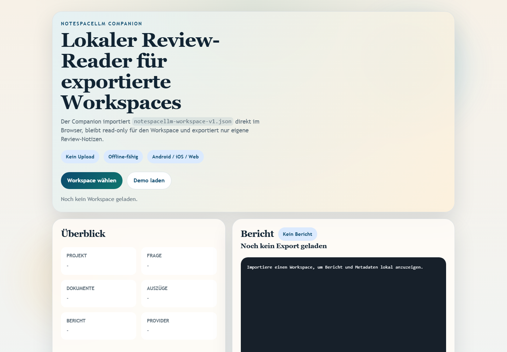

<p align="center">
  
</p>

# NoteSpaceLLM

**Local NotebookLM alternative for private document analysis, RAG-assisted research, and multi-format report generation.**

NoteSpaceLLM is an offline-first PySide6 desktop app for working with PDFs,
Word files, Markdown, mail exports, notes, and research folders. It keeps
project data local by default, supports local or remote Ollama, OpenAI,
Anthropic and Claude Code workflows, and exports analysis results to Markdown,
PDF, DOCX, HTML and TXT. A lightweight Web/PWA Companion is now available for
reviewing exported workspaces on Android, iOS and browser devices without
uploading documents to a server.

**Best-fit searches:** NotebookLM alternative, local RAG document analysis,
private document chat, PySide6 research tool, offline AI report generator,
local-first document workflow.

## English quick start

```bash
git clone https://github.com/file-bricks/NoteSpaceLLM.git
cd NoteSpaceLLM
pip install -r requirements.txt
python main.py
```

Run the test and compile smoke checks with:

```bash
python -m unittest discover -s tests -v
python -m compileall -q main.py manage_translations.py translator.py src
cd web_companion
node --test tests/library.test.mjs
```

## Screenshots




## Deutsch

Ein lokaler, datenschutzfreundlicher Ersatz für Google NotebookLM zur Dokumentenanalyse und Berichterstellung.

## Features

- **Dokumentenverwaltung**: Dateien und Verzeichnisse per Drag & Drop hinzufügen
- **Automatische Extraktion & Auto-Indexierung**: Neue Dokumente werden direkt verarbeitet und für RAG vorbereitet
- **Selektive Auswahl**: Dokumente für Berichterstellung auswählen/abwählen
- **Detailrecherchen**: Rechtsklick für dokumentspezifische Analysen (Sub-Queries)
- **Workflow-Visualisierung**: Grafische Darstellung des Berichtsprozesses
- **Chat-Interface**: Interaktives Chatten über die Dokumente mit LLM
- **Claude Code Integration**: Wahlweise strukturierte API-Antworten oder Übergabe an eine interaktive Claude-Code-Session
- **Multi-Format-Export**: Ausgabe in MD, PDF, DOCX, HTML, TXT
- **Prompt-Export**: Berichtskontext als Markdown-Prompt für externe LLM-Workflows exportieren
- **Remote-Ollama pro Projekt**: Eigene Base-URL und API-Key für lokale oder entfernte Ollama-Server
- **Umlaut-sichere Oberfläche**: Deutsche UI-Texte verwenden echte Umlaute; der Übersetzungs-Scan vermeidet englische False Positives
- **Profile**: Wiederverwendbare Ausgabeformat-Kombinationen

## Desktop-Screenshot


## Installation

```bash
# Repository klonen oder Ordner kopieren
cd NoteSpaceLLM

# Abhängigkeiten installieren
pip install -r requirements.txt

# Anwendung starten
python main.py
```

Unter Windows kann die App alternativ per `start.bat` gestartet werden.

Für einen lokalen Windows-Launcher kann zusätzlich folgender Build ausgeführt
werden:

```bat
build_exe.bat
```

Der Build erzeugt `NoteSpaceLLM.exe` als schlanken Starter für die lokale
Python-Umgebung und die Projekt-Abhängigkeiten.

## Abhängigkeiten prüfen

```bash
python main.py --check
```

## Tests

```bash
python -m unittest discover -s tests -v
python -m compileall -q main.py manage_translations.py translator.py src
```

## LLM-Konfiguration

### Ollama (Lokal - Empfohlen)

1. [Ollama installieren](https://ollama.ai)
2. Modell herunterladen: `ollama pull llama3`
3. In der App: Menü > LLM > Ollama verwenden

### Ollama (Remote-Server)

NoteSpaceLLM kann einen entfernten Ollama-Server nutzen, z.B. über [ellmos-stack](https://github.com/ellmos-ai/ellmos-stack):

1. In der App: Menü > LLM > Einstellungen
2. **Ollama URL:** `http://your-server:11435` (oder eigener Port)
3. **API-Key:** Falls der Server hinter einem Auth-Proxy liegt (empfohlen)

Die Remote-Anbindung eignet sich für:
- Stärkere Modelle auf dedizierter Hardware
- Gemeinsame Nutzung eines LLM-Servers im Team
- Desktop ohne GPU

> **Tipp:** Ollama hat keine eingebaute Authentifizierung. Für Remote-Zugriff empfehlen wir einen Reverse-Proxy (z.B. Nginx) mit API-Key oder Basic Auth.

### OpenAI

```bash
export OPENAI_API_KEY="<your-openai-api-key>"
```

### Anthropic (Claude)

```bash
export ANTHROPIC_API_KEY="<your-anthropic-api-key>"
```

### Claude Code

Für den Provider `claude-code` wird die lokale CLI benötigt:

```bash
npm install -g @anthropic-ai/claude-code
```

In der App stehen zwei Modi bereit:
- **API-Modus**: strukturierte Antwort direkt zurück in NoteSpaceLLM
- **Chat-Modus**: Übergabe des Prompts an eine interaktive Claude-Code-Konsole

## Verwendung

### 1. Dokumente hinzufügen

- **Drag & Drop**: Dateien/Ordner in das linke Panel ziehen
- **Button**: "Dateien hinzufügen" oder "Ordner hinzufügen"

### 2. Dokumente auswählen

- Checkbox: Dokumente für Analyse ein-/ausschließen
- Buttons: "Alle" / "Keine" für Massenauswahl

### 3. Detailrecherchen (optional)

Rechtsklick auf ein Dokument:
- **Zusammenfassung erstellen**: Automatische Zusammenfassung
- **Informationen extrahieren**: Spezifische Daten finden
- **Analysieren**: Gezielte Analyse
- **Frage stellen**: Konkrete Frage zum Dokument

### 4. Hauptfragestellung definieren

Im Workflow-Panel die zentrale Fragestellung eingeben.

### 5. Workflow/Berichtsart wählen

- **Analyse**: Umfassende Analyse mit Empfehlungen
- **Zusammenfassung**: Kurze Zusammenfassung
- **Forschungsbericht**: Akademische Struktur
- **Vergleich**: Systematischer Dokumentenvergleich

### 6. Bericht erstellen

Klick auf "Bericht erstellen" - die Ausgabe erscheint im rechten Panel.

### 7. Exportieren

Ausgabeformate wählen und "Exportieren" klicken.

### 8. Prompt exportieren

Über **"Prompt exportieren"** wird der aktuelle Arbeitskontext als Markdown-Datei gespeichert, um ihn in Claude Code oder anderen LLM-Workflows weiterzuverwenden.

## Projektstruktur

```
NoteSpaceLLM/
├── main.py                 # Startpunkt
├── requirements.txt        # Abhängigkeiten
├── README.md              # Diese Datei
├── src/
│   ├── core/              # Kernfunktionalität
│   │   ├── document_manager.py   # Dokumentenverwaltung
│   │   ├── text_extractor.py     # Textextraktion
│   │   ├── sub_query.py          # Detailrecherchen
│   │   └── project.py            # Projektverwaltung
│   ├── gui/               # PySide6 Benutzeroberfläche
│   │   ├── main_window.py        # Hauptfenster
│   │   ├── document_panel.py     # Dokument-Panel
│   │   ├── workflow_panel.py     # Workflow-Panel
│   │   ├── chat_panel.py         # Chat-Panel
│   │   └── output_panel.py       # Ausgabe-Panel
│   ├── llm/               # LLM-Integration (lokal + remote)
│   │   ├── client.py             # Basis-Client + Factory
│   │   ├── ollama_client.py      # Ollama (lokal & remote, mit Auth)
│   │   ├── openai_client.py      # OpenAI
│   │   └── anthropic_client.py   # Anthropic
│   └── reports/           # Berichterstellung
│       ├── generator.py          # Berichtsgenerierung
│       ├── templates.py          # Vorlagen
│       └── exporter.py           # Export
├── data/                  # Datenverzeichnis
├── workflows/             # Workflow-Definitionen
├── profiles/              # Ausgabeprofile
└── output/                # Exportierte Berichte
```

## Unterstützte Dateiformate

| Format | Lesen | Schreiben |
|--------|-------|-----------|
| PDF    | ✅    | ✅        |
| DOCX   | ✅    | ✅        |
| DOC    | ⚠️    | -         |
| TXT    | ✅    | ✅        |
| MD     | ✅    | ✅        |
| XLSX   | ✅    | -         |
| HTML   | -     | ✅        |
| EML    | ✅    | -         |
| MSG    | ✅    | -         |

⚠️ .doc benötigt antiword oder LibreOffice

## Tips

1. **Große Dokumente**: Bei vielen Dokumenten zuerst nur wichtige auswählen
2. **Detailrecherchen**: Für bessere Ergebnisse gezielte Sub-Queries nutzen
3. **Ollama**: Für Datenschutz und Offline-Nutzung empfohlen
4. **Workflow anpassen**: Schritte können umgeordnet werden

## Datenschutz

NoteSpaceLLM verarbeitet Projekte, Dokumentindexe und Exporte standardmäßig lokal in den Projektordnern `data/`, `profiles/`, `workflows/`, `output/` und `chroma_db/`. Diese Ordner sind bewusst nicht für Git vorgesehen.

Wenn externe oder entfernte LLM-Provider wie OpenAI, Anthropic, Claude Code oder ein Remote-Ollama-Server gewählt werden, können Prompts und ausgewählte Dokumentauszüge an diese Dienste oder Server übertragen werden. Verwende für vertrauliche Dokumente bevorzugt lokale Modelle und prüfe vor dem Teilen eines Projektordners die enthaltenen Daten.

## Plattformstrategie

Die Desktop-App bleibt die autoritative Vollversion für lokale Dokumente, RAG-Index, LLM-Provider und vertrauliche Arbeitsstände. Für Android, iOS und Browser ist ein Web/PWA-Companion als getrennte Linie geplant, der über `notespacellm-workspace-v1.json` mit der Desktop-App Daten austauscht. Details stehen in `PORTIERUNGSPLAN.md` und `EXPORTFORMAT.md`.

### Web/PWA-Companion

Unter `web_companion/` liegt jetzt der erste read-only Companion-Strang für
Android, iOS und Browser. Er importiert exportierte
`notespacellm-workspace-v1.json`-Dateien lokal im Browser, zeigt Bericht,
Dokumentmetadaten und ausgewählte Auszüge an und kann eigene Review-Notizen als
Markdown exportieren.

Für lokale Browser-Tests reicht ein kleiner statischer Server:

```powershell
$env:PYTHONIOENCODING='utf-8'
python -m http.server 8765 -d web_companion
```

Die Companion-Smokes laufen über:

```powershell
cd web_companion
node --test tests/library.test.mjs
```

## Entwicklung

Die Anwendung ist modular aufgebaut und trennt Dokumentverwaltung, Text-Extraktion, RAG-Index, LLM-Provider und Report-Export.

## Lizenz

AGPL v3 - Siehe [LICENSE](LICENSE)

Dieses Projekt verwendet PySide6 (LGPL) und PyMuPDF (AGPL).

---

## English

A local replacement for Google NotebookLM with LLM integration and multi-format export.

### Features

- Local LLM integration
- Automatic extraction and auto-indexing for newly added documents
- Multi-format document import
- AI-powered summaries
- Claude Code provider with API and interactive chat modes
- Prompt export for external LLM workflows
- German UI strings use native umlauts, while the translation scanner avoids English false positives
- Export to multiple formats

### Screenshot


### Installation

```bash
git clone https://github.com/file-bricks/NoteSpaceLLM.git
cd NoteSpaceLLM
pip install -r requirements.txt
python "main.py"
```

On Windows, you can also launch the app via `start.bat`.

A local Windows launcher can also be built with `build_exe.bat`.

### License

See [LICENSE](LICENSE) for details.

### Privacy

Project data, indexes, profiles, workflow settings, and exports are local by default and intentionally excluded from Git. External or remote LLM providers may receive prompts and selected document excerpts when enabled.

---

## Haftung / Liability

Dieses Projekt ist eine **unentgeltliche Open-Source-Schenkung** im Sinne der §§ 516 ff. BGB. Die Haftung des Urhebers ist gemäß **§ 521 BGB** auf **Vorsatz und grobe Fahrlässigkeit** beschränkt. Ergänzend gelten die Haftungsausschlüsse der GNU Affero General Public License v3.0, insbesondere §§ 15–16.

Nutzung auf eigenes Risiko. Keine Wartungszusage, keine Verfügbarkeitsgarantie, keine Gewähr für Fehlerfreiheit oder Eignung für einen bestimmten Zweck.

This project is an unpaid open-source donation. Liability is limited to intent and gross negligence (§ 521 German Civil Code). Use at your own risk. No warranty, no maintenance guarantee, no fitness-for-purpose assumed.

